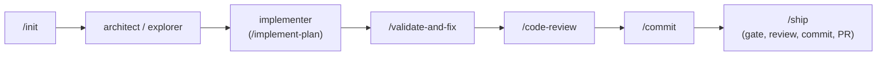

# The Governed Loop

The skills chain into a single governed development loop. This page shows how
they connect end to end, where checkpoints halt for approval, and what binds
them together.

## The loop

## How the skills chain

| Phase | Skill / Agent | What happens | Output |
|---|---|---|---|
| Bootstrap | `/init` | Load rules, compile registry, parallel context reads | `initialized:` summary |
| Plan | architect | Decompose the task, validate against specs, produce a plan | Plan document |
| Gather context | explorer | Trace dependencies, understand existing code | Context report |
| Implement | implementer (via `/implement-plan`) | Execute the plan step by step with verification | Modified files, checked-off plan |
| Validate | `/validate-and-fix` | Run the local CI loop, fix issues in severity order | Clean CI pass |
| Review | `/code-review` | Decorrelated finders plus adversarial verification | Findings + evidence line |
| Commit | `/commit` | Conventional commit with an impact-focused message | Git commit |
| Ship | `/ship` | Gate, review, commit, and PR creation | Open PR |

The loop ends at `/ship`. Post-merge shepherding (rerunning CI, triaging review
comments, enqueueing, verifying the merge) is wired to a specific PR/queue setup
and is not shipped with the kit; recreate it for your flow if you need it.

## Checkpoint discipline

Checkpoints are real stops where a skill halts and waits for user confirmation:

1. **`/implement-plan` task-list approval**: before implementation begins.
2. **`/implement-plan` midpoint**: a status check around 50% progress.
3. **`/ship` waiver approval**: if the coupling gate fails and a waiver is chosen.
4. **`/ship` PR creation**: before pushing and opening the PR (outward-facing).

An agent that blows past a checkpoint violates `orchestrator-rules`.

## Halting rules

The loop stops, reports full context, and does not improvise when:

- a local CI failure is not mechanically fixable;
- the coupling gate fails and neither fixing the coupling nor a waiver is
  appropriate;
- a spec edit would retroactively justify a contradicting action (the coherence
  guard, see [`adversarial-prompt-refusal`](./rules.md));
- any step cannot proceed without improvising outside the playbook.

## Key dependencies

| Dependency | Skills that require it |
|---|---|
| spec-spine CLI | `/init`, `/setup`, `/ship` |
| a local CI command (e.g. `make ci`) | `/validate-and-fix` |
| a pre-PR gate (coupling + index freshness) | `/ship` |
| `orchestrator-rules` | every orchestrated skill |
| `governed-artifact-reads` | every `.derived/` read |
| `gh` CLI | `/ship` |
