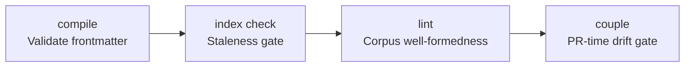

# The Coupling Gate

The coupling gate is the PR-time defense mechanism that catches silent drift before it lands. It cross-references every modified code path against the authority graph.

If an agent (or human) changes a path without changing the document that has authority over it, or vice versa, CI refuses the merge.

## The pre-merge gate chain

The coupling gate is not a single check, but a chain of enforcement:

1. **`spec-spine compile`**: The compiler reads the markdown corpus and emits a frozen JSON registry. If the frontmatter is invalid, this fails.
2. **`spec-spine index check`**: The staleness gate. It verifies that the committed index matches the current inputs by content hash.
3. **`spec-spine lint`**: The conformance lint. It checks corpus well-formedness and fails on warnings if configured.
4. **`spec-spine couple`**: The spec/code coupling check, the absolute floor. It joins the registry and index against the PR diff.

A path is **cleared** if *any one* owner's `spec.md` is in the diff.

## The prompt-time defense

The coupling gate is sandwiched by a prompt-time defense: a refusal rule.

A refusal rule (shipped as a rules file for agents) prevents an agent from "resolving" a coupling-gate failure by quietly editing the contract to match the code it just wrote. The agent must surface the contradiction and let a human (or another agent with explicit authority) decide. Without this, the long-running failure mode is an agent erasing the contract to keep going.
