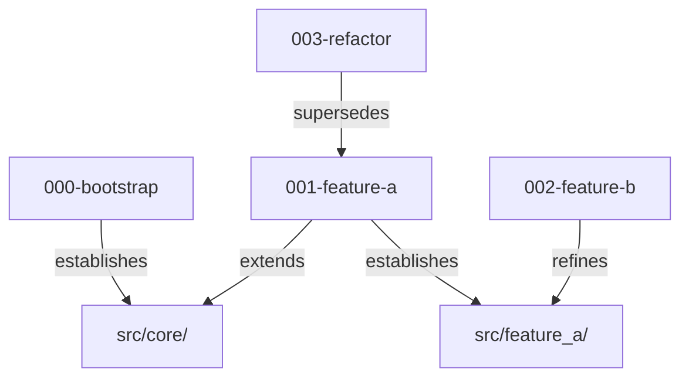

# Concepts Overview

spec-spine is a typed, hash-verifiable ledger of who-owns-what, sitting underneath a codebase so that many agents can work in parallel without trampling each other. 

What looks from the outside like a pile of markdown is a contract surface with formal ownership semantics. The contract is the substrate, a deterministic compiler enforces its shape, a typed read layer enforces how it is read, gates enforce its truthfulness at PR time, and a refusal rule enforces its truthfulness at prompt time. Remove any one layer and the others stop being sufficient.

## The problem it solves

Unconstrained agentic output is unprocessable. A human will not review every line an agent produces, and pretending otherwise just moves the bottleneck back to the human. The only honest move is to stop reviewing output and start constraining intent.

Intent becomes a requirement. The requirement defines a spec. The spec is law.

Everything downstream (the compiler, the registries, the coupling gate, the refusal rule) is mechanical enforcement of that law. The human writes the contract once; the machinery enforces it on every diff, forever. This is what lets one person sit at the helm of a development effort and steer it without the structure becoming incoherent or drifting from the original intent. The human authors the law; the agents comply with it; the spine makes non-compliance impossible to merge.

Treat all agentic output as hostile by default. Agents earn passage by surviving the gates, not by appealing to trust. When the work is large enough to need many of them, pit them against each other: divide the territory, type the boundaries, let the spine arbitrate. Parallel agents do not need to cooperate; cooperation is a property of the substrate, not a virtue the agents have to share.

## The core idea

Every piece of work in a repository, every feature, every refactor, every infrastructure change, is anchored to a small markdown document that declares its territory. The territory is not a vague description; it is an explicit list of code paths plus a set of *typed relationships* to the other documents that have touched those paths before. Together those documents form a graph, and the graph is the source of truth about who is allowed to change what.

Three properties fall out of this design:

1. **Disjoint territory is provably disjoint.** Two agents working on documents that establish or refine non-overlapping paths cannot collide by construction. The graph tells them so before either edits a line.
2. **Shared territory is typed, not undefined.** When two documents touch the same path, say a project-wide build file where many features add targets, they declare co-authority section-by-section, with named anchors. The collision becomes a structured merge, not a free-for-all.
3. **History is queryable.** "Who established this file" and "who currently has authority over it" are different questions. An amendment does not blow away its predecessor; it patches it in place, and consumers see the patched view. Two agents can refine different aspects of the same predecessor in parallel without one having to wait for the other.

## Two registries, two directions

spec-spine maintains two deterministic views of the world:

- **The spec-as-source view**: what does each spec say? For each spec: its status, its relationships, the paths it claims. Read through the registry query layer (`list`, `show`, `status-report`, relationship and authority queries). This is the output of the compiler.
- **The code-as-source view**: for each path / section / symbol in the repo, which spec(s) currently claim authority over it? Built by the codebase indexer (`spec-spine index`), with `index check` detecting staleness by content hash.

They are inverses. The coupling gate joins them at PR time and refuses the merge if they disagree.
